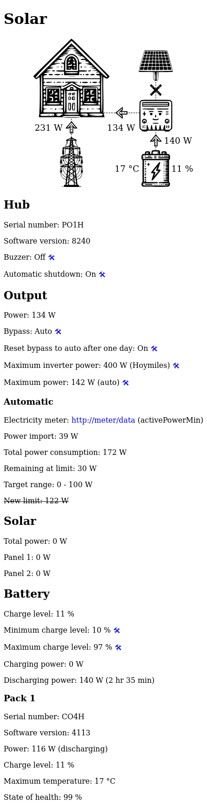

# Solar

A MicroPython-based web interface for controlling Zendure SolarFlow via Bluetooth.
It can automatically adjust the output power based on data from the electricity meter.

## Tested devices

* Smart PV Hub 1200 Controller
* Add-on Battery AB1000

## Screenshots



## Prerequisites

### Hardware

* Raspberry Pi Pico W

### Software

* [Thonny IDE](https://thonny.org/) or similar for editing and
  uploading files to Raspberry Pi Pico

## Installation

### Prepare the Pi Pico

Install MicroPython by following the [official guides](https://www.raspberrypi.com/documentation/microcontrollers/micropython.html)
for you specific hardware.

### Copy Files to Pi Pico

Transfer the following files/folders to the root directory
(using Thonny IDE or similar):

* `config.py`
* `diagram.svgz`
* `locale`
* `main.py`

Create a `lib` folder within the root directory and copy the following
libraries there:

* [aioble](https://github.com/micropython/micropython-lib/tree/master/micropython/bluetooth/aioble):
  Copy the folder `aioble` into the `lib` directory
* [microdot](https://github.com/miguelgrinberg/microdot):
  Copy the files `scr/microdot/__init__.py` and `src/microdot/microdot.py`
  into the `lib/microdot` directory.

### Configure settings

Open the file `config.py` and set your WIFI credentials, hostname,
Zendure SolarFlow bluetooth address and [electricity meter](https://github.com/Unrud/Meter) (optional):

```python
# Example
WIFI_SSID = "your ssid"
WIFI_PASSWORD = "your password"
HOSTNAME = "solar"
WIFI_COUNTRY = "it"

DEVICE_MAC = "94:c9:60:84:74:52"
DEVICE_ID = "1aB2c3dE"

METER_ENDPOINT = "http://meter/data"
METER_POWER_FIELD = "activePowerMin"
METER_POWER_DISPLAY_FIELD = "activePowerAvg"
```

## Usage

Connect to the device using a web browser at `http://<hostname>`.
Replace `<hostname>` with the value set in `config.py`.

See `http://<hostname>/data` for JSON data.

Additional diagnostic information can be found at `http://<hostname>/raw-data`.
